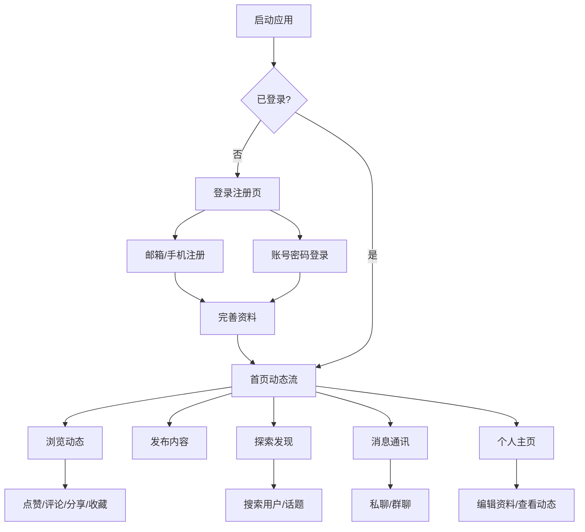

## 1. 产品概述

一款跨平台社交应用，采用 PWA（渐进式 Web 应用）技术架构，支持 Windows、macOS、Android 和 iOS 全平台流畅运行。用户可以发布动态、互动交流、即时通讯，打造属于自己的社交圈。

- 面向广大社交用户，提供一站式社交体验，涵盖动态发布、好友互动、即时通讯、内容发现等核心功能
- 通过 Web 技术实现跨平台覆盖，降低开发与维护成本，确保各平台体验一致性

## 2. 核心功能

### 2.1 用户角色

| 角色 | 注册方式 | 核心权限 |
|------|----------|----------|
| 普通用户 | 邮箱/手机号注册 | 浏览动态、发布内容、互动交流、即时通讯 |
| 认证用户 | 实名认证升级 | 拥有认证标识、内容优先推荐 |

### 2.2 功能模块

1. **登录注册页**：品牌展示、登录表单、注册表单、忘记密码
2. **首页/动态流**：动态信息流、故事条、推荐用户、热门话题
3. **探索/发现页**：搜索功能、热门话题、推荐内容、分类浏览
4. **发布页**：图文编辑、图片上传、话题标签、位置标记
5. **消息页**：聊天列表、即时通讯、群聊、消息通知
6. **个人主页**：用户资料、动态列表、关注/粉丝、个人相册
7. **通知页**：互动通知、系统通知、消息提醒
8. **设置页**：账号设置、隐私设置、通知设置、主题切换

### 2.3 页面详情

| 页面名称 | 模块名称 | 功能描述 |
|----------|----------|----------|
| 登录注册页 | 品牌展示区 | 应用 Logo、品牌标语、背景动画 |
| 登录注册页 | 登录表单 | 邮箱/手机号登录、密码登录、第三方登录入口 |
| 登录注册页 | 注册表单 | 邮箱/手机号注册、验证码验证、密码设置 |
| 首页/动态流 | 故事条 | 横向滑动故事列表、添加故事入口、故事查看器 |
| 首页/动态流 | 动态信息流 | 图文动态卡片、视频动态卡片、转发动效 |
| 首页/动态流 | 互动栏 | 点赞（含动画）、评论、分享、收藏按钮 |
| 首页/动态流 | 推荐侧栏 | 推荐关注用户、热门话题标签 |
| 探索/发现页 | 搜索栏 | 实时搜索建议、搜索历史、热搜榜 |
| 探索/发现页 | 内容瀑布流 | 瀑布流图片/视频展示、分类标签筛选 |
| 探索/发现页 | 话题广场 | 热门话题排行、话题详情页 |
| 发布页 | 编辑器 | 富文本输入、表情选择器、@好友功能 |
| 发布页 | 媒体上传 | 多图上传、图片裁剪、视频上传预览 |
| 发布页 | 附加选项 | 话题标签选择、位置标记、可见范围设置 |
| 消息页 | 聊天列表 | 最近聊天列表、未读消息标记、置顶聊天 |
| 消息页 | 聊天窗口 | 文字/图片/语音消息、表情包、消息已读状态 |
| 消息页 | 群聊功能 | 创建群聊、群成员管理、群公告 |
| 个人主页 | 资料卡片 | 头像、昵称、简介、认证标识、编辑资料入口 |
| 个人主页 | 数据统计 | 动态数、关注数、粉丝数 |
| 个人主页 | 内容展示 | 动态列表/相册视图切换、内容网格展示 |
| 通知页 | 通知列表 | 互动通知（点赞/评论/关注）、系统通知、消息分类筛选 |
| 设置页 | 账号设置 | 修改密码、绑定手机/邮箱、注销账号 |
| 设置页 | 隐私设置 | 私密账号、评论权限、消息权限 |
| 设置页 | 外观设置 | 深色/浅色主题切换、字体大小调节 |

## 3. 核心流程

用户注册登录后进入首页动态流，可浏览和互动他人内容；通过发布功能创建图文动态；通过探索页发现新内容和用户；通过消息页与好友即时通讯；个人主页展示用户资料和历史内容。

## 4. 用户界面设计

### 4.1 设计风格

- **主色调**：珊瑚橙 (#FF6B6B) + 深空蓝 (#1A1A2E)，活力与沉稳的碰撞
- **辅助色**：薄荷绿 (#4ECDC4) 用于成功状态，暖黄 (#FFE66D) 用于提醒
- **按钮风格**：圆角胶囊按钮，主按钮带微渐变和悬浮阴影，次要按钮为描边样式
- **字体**：标题使用 Outfit（现代几何感），正文使用 Noto Sans SC（中文优化）
- **布局风格**：移动端底部导航栏 + 桌面端侧边导航栏，卡片式内容展示
- **图标风格**：线性图标（Lucide），2px 描边，圆角端点
- **动效**：页面切换滑动过渡、点赞心跳动画、消息气泡弹入、加载骨架屏

### 4.2 页面设计概览

| 页面名称 | 模块名称 | UI 元素 |
|----------|----------|---------|
| 登录注册页 | 品牌展示区 | 渐变背景、Logo 动画、品牌标语、浮动装饰元素 |
| 登录注册页 | 表单区 | 圆角输入框、浮动标签、胶囊登录按钮、第三方登录图标 |
| 首页/动态流 | 故事条 | 圆形头像渐变边框、横向滚动、添加按钮 |
| 首页/动态流 | 动态卡片 | 用户信息栏、图片/视频区域、互动按钮栏、评论区入口 |
| 首页/动态流 | 侧栏 | 推荐用户卡片、热门话题标签云 |
| 探索/发现页 | 搜索区 | 大圆角搜索框、热搜标签胶囊、搜索历史列表 |
| 探索/发现页 | 内容区 | 瀑布流双列布局、图片卡片悬浮放大效果 |
| 发布页 | 编辑区 | 大文本输入框、工具栏（表情/图片/话题/位置） |
| 发布页 | 预览区 | 图片缩略图网格、删除/排序操作 |
| 消息页 | 列表区 | 头像+昵称+最后消息、未读红点、时间戳 |
| 消息页 | 聊天窗口 | 气泡消息、输入框+工具栏、已读回执 |
| 个人主页 | 资料区 | 大头像、渐变背景封面、数据统计行、编辑按钮 |
| 个人主页 | 内容区 | Tab 切换（动态/相册）、网格/列表视图 |
| 通知页 | 列表区 | 分类 Tab、通知卡片（头像+描述+时间）、已读标记 |
| 设置页 | 列表区 | 分组设置项、开关控件、箭头导航、主题切换 |

### 4.3 响应式设计

- **桌面优先**：最大宽度 1280px 居中布局，三栏布局（侧导航 + 主内容 + 侧栏推荐）
- **平板适配**：两栏布局（侧导航收缩为图标 + 主内容），隐藏侧栏推荐
- **移动端适配**：单栏布局，底部导航栏，全屏内容展示，触摸优化（按钮最小 44px 点击区域）
- **PWA 支持**：添加到主屏幕、离线缓存、推送通知、沉浸式状态栏

### 4.4 设计特色

- 深色/浅色主题无缝切换，跟随系统或手动设置
- 动态流支持下拉刷新动画（自定义弹性效果）
- 图片查看器支持手势缩放和滑动切换
- 消息页支持滑动快捷操作（删除、置顶）
- 发布页支持拖拽排序图片
- 全局搜索支持模糊匹配和实时建议
