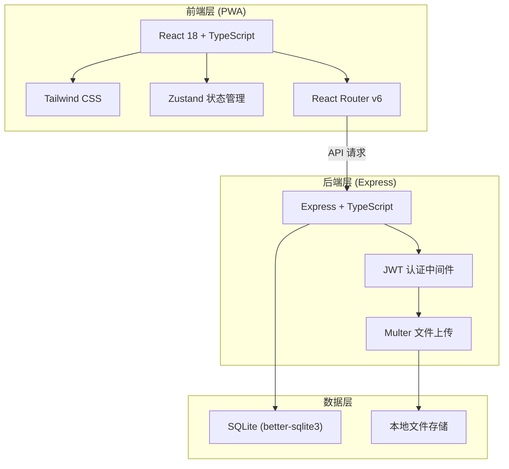
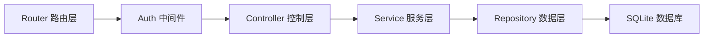
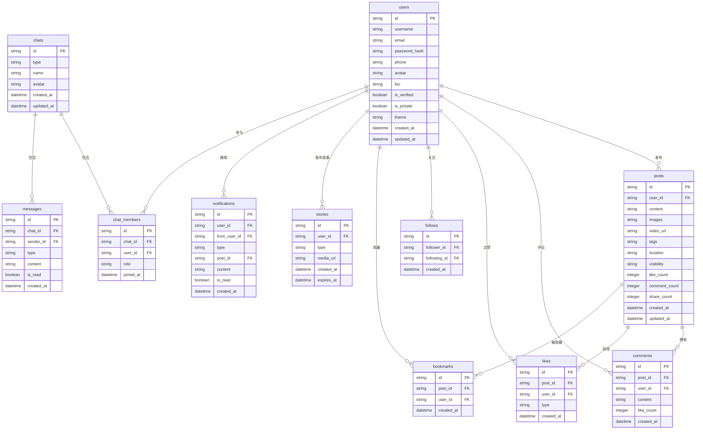

## 1. 架构设计



## 2. 技术说明

- **前端**：React@18 + TypeScript + Tailwind CSS@3 + Vite
- **初始化工具**：vite-init (react-express-ts 模板)
- **状态管理**：Zustand
- **路由**：React Router DOM v6
- **图标库**：lucide-react
- **后端**：Express@4 + TypeScript (ESM)
- **数据库**：SQLite (better-sqlite3)
- **认证**：JWT (jsonwebtoken)
- **文件上传**：Multer
- **密码加密**：bcryptjs

## 3. 路由定义

| 路由 | 用途 |
|------|------|
| `/login` | 登录页面 |
| `/register` | 注册页面 |
| `/` | 首页动态流 |
| `/explore` | 探索发现页 |
| `/publish` | 发布内容页 |
| `/messages` | 消息列表页 |
| `/messages/:chatId` | 聊天详情页 |
| `/profile/:userId` | 个人主页 |
| `/notifications` | 通知页 |
| `/settings` | 设置页 |
| `/story/:storyId` | 故事查看页 |
| `/post/:postId` | 动态详情页 |

## 4. API 定义

### 4.1 认证相关

```typescript
interface RegisterRequest {
  email: string;
  password: string;
  username: string;
  phone?: string;
}

interface LoginRequest {
  email: string;
  password: string;
}

interface AuthResponse {
  token: string;
  user: UserProfile;
}

// POST /api/auth/register
// POST /api/auth/login
```

### 4.2 用户相关

```typescript
interface UserProfile {
  id: string;
  username: string;
  email: string;
  phone?: string;
  avatar?: string;
  bio?: string;
  isVerified: boolean;
  postCount: number;
  followerCount: number;
  followingCount: number;
  createdAt: string;
}

// GET /api/users/:userId
// PUT /api/users/profile
// POST /api/users/:userId/follow
// DELETE /api/users/:userId/follow
// GET /api/users/:userId/followers
// GET /api/users/:userId/following
```

### 4.3 动态相关

```typescript
interface Post {
  id: string;
  userId: string;
  user: UserProfile;
  content: string;
  images?: string[];
  videoUrl?: string;
  tags?: string[];
  location?: string;
  likeCount: number;
  commentCount: number;
  shareCount: number;
  isLiked: boolean;
  isBookmarked: boolean;
  createdAt: string;
}

interface CreatePostRequest {
  content: string;
  images?: File[];
  tags?: string[];
  location?: string;
  visibility: 'public' | 'friends' | 'private';
}

// GET /api/posts/feed?page=1&limit=20
// GET /api/posts/:postId
// POST /api/posts
// DELETE /api/posts/:postId
// POST /api/posts/:postId/like
// DELETE /api/posts/:postId/like
// POST /api/posts/:postId/bookmark
// DELETE /api/posts/:postId/bookmark
```

### 4.4 评论相关

```typescript
interface Comment {
  id: string;
  postId: string;
  userId: string;
  user: UserProfile;
  content: string;
  likeCount: number;
  isLiked: boolean;
  createdAt: string;
}

// GET /api/posts/:postId/comments?page=1&limit=20
// POST /api/posts/:postId/comments
// DELETE /api/comments/:commentId
// POST /api/comments/:commentId/like
```

### 4.5 消息相关

```typescript
interface Chat {
  id: string;
  type: 'private' | 'group';
  name?: string;
  avatar?: string;
  members: UserProfile[];
  lastMessage?: Message;
  unreadCount: number;
  updatedAt: string;
}

interface Message {
  id: string;
  chatId: string;
  senderId: string;
  sender: UserProfile;
  type: 'text' | 'image' | 'system';
  content: string;
  isRead: boolean;
  createdAt: string;
}

// GET /api/chats
// POST /api/chats
// GET /api/chats/:chatId/messages?page=1&limit=50
// POST /api/chats/:chatId/messages
```

### 4.6 通知相关

```typescript
interface Notification {
  id: string;
  type: 'like' | 'comment' | 'follow' | 'system';
  fromUser?: UserProfile;
  postId?: string;
  content: string;
  isRead: boolean;
  createdAt: string;
}

// GET /api/notifications?page=1&limit=20
// PUT /api/notifications/read
// PUT /api/notifications/read-all
```

### 4.7 搜索相关

```typescript
interface SearchResult {
  users: UserProfile[];
  posts: Post[];
  tags: { name: string; count: number }[];
}

// GET /api/search?q=keyword&type=all
// GET /api/search/suggestions?q=keyword
```

### 4.8 故事相关

```typescript
interface Story {
  id: string;
  userId: string;
  user: UserProfile;
  type: 'image' | 'video';
  mediaUrl: string;
  createdAt: string;
  expiresAt: string;
}

// GET /api/stories
// POST /api/stories
// GET /api/stories/:userId
```

## 5. 服务器架构图



## 6. 数据模型

### 6.1 数据模型定义



### 6.2 数据定义语言

```sql
CREATE TABLE users (
  id TEXT PRIMARY KEY DEFAULT (lower(hex(randomblob(16)))),
  username TEXT NOT NULL UNIQUE,
  email TEXT NOT NULL UNIQUE,
  password_hash TEXT NOT NULL,
  phone TEXT,
  avatar TEXT,
  bio TEXT DEFAULT '',
  is_verified INTEGER DEFAULT 0,
  is_private INTEGER DEFAULT 0,
  theme TEXT DEFAULT 'light',
  created_at TEXT DEFAULT (datetime('now')),
  updated_at TEXT DEFAULT (datetime('now'))
);

CREATE TABLE posts (
  id TEXT PRIMARY KEY DEFAULT (lower(hex(randomblob(16)))),
  user_id TEXT NOT NULL REFERENCES users(id) ON DELETE CASCADE,
  content TEXT NOT NULL DEFAULT '',
  images TEXT DEFAULT '[]',
  video_url TEXT,
  tags TEXT DEFAULT '[]',
  location TEXT,
  visibility TEXT DEFAULT 'public' CHECK (visibility IN ('public', 'friends', 'private')),
  like_count INTEGER DEFAULT 0,
  comment_count INTEGER DEFAULT 0,
  share_count INTEGER DEFAULT 0,
  created_at TEXT DEFAULT (datetime('now')),
  updated_at TEXT DEFAULT (datetime('now'))
);

CREATE TABLE comments (
  id TEXT PRIMARY KEY DEFAULT (lower(hex(randomblob(16)))),
  post_id TEXT NOT NULL REFERENCES posts(id) ON DELETE CASCADE,
  user_id TEXT NOT NULL REFERENCES users(id) ON DELETE CASCADE,
  content TEXT NOT NULL,
  like_count INTEGER DEFAULT 0,
  created_at TEXT DEFAULT (datetime('now'))
);

CREATE TABLE likes (
  id TEXT PRIMARY KEY DEFAULT (lower(hex(randomblob(16)))),
  post_id TEXT REFERENCES posts(id) ON DELETE CASCADE,
  comment_id TEXT REFERENCES comments(id) ON DELETE CASCADE,
  user_id TEXT NOT NULL REFERENCES users(id) ON DELETE CASCADE,
  type TEXT DEFAULT 'post' CHECK (type IN ('post', 'comment')),
  created_at TEXT DEFAULT (datetime('now')),
  UNIQUE(post_id, user_id, type),
  UNIQUE(comment_id, user_id, type)
);

CREATE TABLE follows (
  id TEXT PRIMARY KEY DEFAULT (lower(hex(randomblob(16)))),
  follower_id TEXT NOT NULL REFERENCES users(id) ON DELETE CASCADE,
  following_id TEXT NOT NULL REFERENCES users(id) ON DELETE CASCADE,
  created_at TEXT DEFAULT (datetime('now')),
  UNIQUE(follower_id, following_id)
);

CREATE TABLE bookmarks (
  id TEXT PRIMARY KEY DEFAULT (lower(hex(randomblob(16)))),
  post_id TEXT NOT NULL REFERENCES posts(id) ON DELETE CASCADE,
  user_id TEXT NOT NULL REFERENCES users(id) ON DELETE CASCADE,
  created_at TEXT DEFAULT (datetime('now')),
  UNIQUE(post_id, user_id)
);

CREATE TABLE chats (
  id TEXT PRIMARY KEY DEFAULT (lower(hex(randomblob(16)))),
  type TEXT NOT NULL DEFAULT 'private' CHECK (type IN ('private', 'group')),
  name TEXT,
  avatar TEXT,
  created_at TEXT DEFAULT (datetime('now')),
  updated_at TEXT DEFAULT (datetime('now'))
);

CREATE TABLE chat_members (
  id TEXT PRIMARY KEY DEFAULT (lower(hex(randomblob(16)))),
  chat_id TEXT NOT NULL REFERENCES chats(id) ON DELETE CASCADE,
  user_id TEXT NOT NULL REFERENCES users(id) ON DELETE CASCADE,
  role TEXT DEFAULT 'member' CHECK (role IN ('admin', 'member')),
  joined_at TEXT DEFAULT (datetime('now')),
  UNIQUE(chat_id, user_id)
);

CREATE TABLE messages (
  id TEXT PRIMARY KEY DEFAULT (lower(hex(randomblob(16)))),
  chat_id TEXT NOT NULL REFERENCES chats(id) ON DELETE CASCADE,
  sender_id TEXT NOT NULL REFERENCES users(id) ON DELETE CASCADE,
  type TEXT DEFAULT 'text' CHECK (type IN ('text', 'image', 'system')),
  content TEXT NOT NULL,
  is_read INTEGER DEFAULT 0,
  created_at TEXT DEFAULT (datetime('now'))
);

CREATE TABLE notifications (
  id TEXT PRIMARY KEY DEFAULT (lower(hex(randomblob(16)))),
  user_id TEXT NOT NULL REFERENCES users(id) ON DELETE CASCADE,
  from_user_id TEXT REFERENCES users(id) ON DELETE CASCADE,
  type TEXT NOT NULL CHECK (type IN ('like', 'comment', 'follow', 'system')),
  post_id TEXT REFERENCES posts(id) ON DELETE CASCADE,
  content TEXT DEFAULT '',
  is_read INTEGER DEFAULT 0,
  created_at TEXT DEFAULT (datetime('now'))
);

CREATE TABLE stories (
  id TEXT PRIMARY KEY DEFAULT (lower(hex(randomblob(16)))),
  user_id TEXT NOT NULL REFERENCES users(id) ON DELETE CASCADE,
  type TEXT DEFAULT 'image' CHECK (type IN ('image', 'video')),
  media_url TEXT NOT NULL,
  created_at TEXT DEFAULT (datetime('now')),
  expires_at TEXT NOT NULL
);

CREATE INDEX idx_posts_user_id ON posts(user_id);
CREATE INDEX idx_posts_created_at ON posts(created_at DESC);
CREATE INDEX idx_comments_post_id ON comments(post_id);
CREATE INDEX idx_likes_post_id ON likes(post_id);
CREATE INDEX idx_likes_user_id ON likes(user_id);
CREATE INDEX idx_follows_follower ON follows(follower_id);
CREATE INDEX idx_follows_following ON follows(following_id);
CREATE INDEX idx_messages_chat_id ON messages(chat_id);
CREATE INDEX idx_messages_created_at ON messages(created_at DESC);
CREATE INDEX idx_notifications_user_id ON notifications(user_id);
CREATE INDEX idx_notifications_is_read ON notifications(is_read);
CREATE INDEX idx_stories_user_id ON stories(user_id);
CREATE INDEX idx_stories_expires_at ON stories(expires_at);
```
