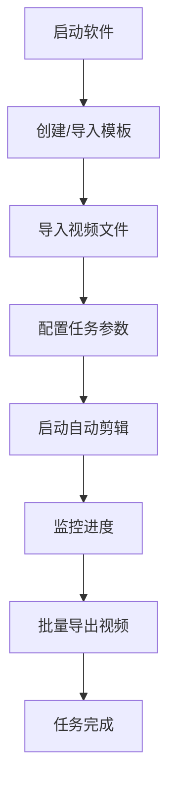

# 剪映自动剪辑软件 - 产品需求文档

## 1. 产品概述
剪映自动剪辑软件是一款跨平台桌面应用，旨在帮助用户自动化完成视频剪辑工作，提高视频制作效率。
- 解决手动剪辑视频繁琐耗时的问题，目标用户为内容创作者、视频编辑人员和营销人员
- 通过自动化流程、模板套用和智能剪辑功能，大幅提升视频制作效率

## 2. 核心功能

### 2.1 用户角色
| 角色 | 注册方式 | 核心权限 |
|------|---------|---------|
| 普通用户 | 无需注册 | 使用全部功能，创建和管理剪辑模板 |

### 2.2 功能模块
1. **主界面**：项目管理、任务列表、控制面板
2. **模板管理**：模板创建、编辑、保存和导入导出
3. **任务配置**：视频导入、参数设置、任务调度
4. **任务执行**：自动化剪辑、进度监控、批量导出

### 2.3 页面详情
| 页面名称 | 模块名称 | 功能描述 |
|---------|---------|---------|
| 主界面 | 项目管理 | 显示当前项目，可新建、打开和保存项目 |
| 主界面 | 任务列表 | 显示所有待执行和已完成的任务 |
| 主界面 | 控制面板 | 提供开始、暂停、停止按钮和进度显示 |
| 模板管理 | 模板编辑器 | 创建和编辑剪辑模板，设置剪辑规则 |
| 任务配置 | 视频导入 | 批量导入视频文件，支持拖拽操作 |
| 任务配置 | 参数设置 | 配置剪辑参数、输出格式和质量 |

## 3. 核心流程
用户首先创建或导入剪辑模板，然后批量导入视频文件，配置任务参数后启动自动化剪辑过程。软件自动控制剪映应用完成剪辑工作，并批量导出结果。

## 4. 用户界面设计

### 4.1 设计风格
- 主色调：深蓝色 (#165DFF)，次要色：浅蓝色 (#4080FF)
- 按钮风格：扁平化圆角按钮
- 字体：Inter 无衬线字体，主标题 20px，副标题 16px，正文 14px
- 布局风格：左侧导航栏 + 右侧内容区域的分栏布局
- 图标风格：简约线性图标

### 4.2 页面设计概述
| 页面名称 | 模块名称 | UI 元素 |
|---------|---------|---------|
| 主界面 | 项目管理 | 顶部工具栏，项目信息卡片，操作按钮 |
| 主界面 | 任务列表 | 表格布局，显示任务状态、进度、时长等信息 |
| 主界面 | 控制面板 | 大尺寸操作按钮，进度条，日志输出区域 |
| 模板管理 | 模板编辑器 | 树形结构显示模板规则，属性面板，预览区域 |
| 任务配置 | 视频导入 | 文件列表，拖拽区域，文件信息显示 |
| 任务配置 | 参数设置 | 表单布局，下拉选择，滑块调节，实时预览 |

### 4.3 响应式
桌面端优先，支持窗口缩放和布局自适应，适配不同分辨率显示器

