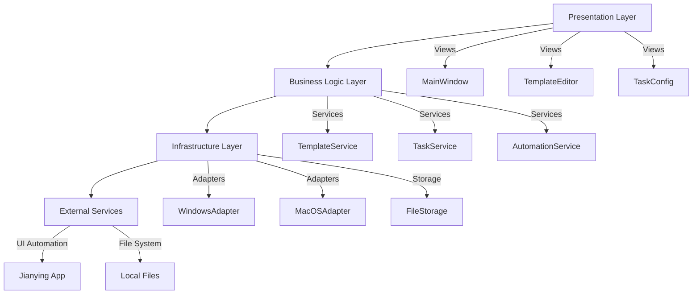

# 剪映自动剪辑软件 - 技术架构文档

## 1. 架构设计



## 2. 技术描述

- **前端/UI框架**: Avalonia UI 11.x（跨平台 .NET UI框架）
- **开发语言**: C# 12
- **框架**: .NET 8
- **自动化工具**: 
  - Windows: FlaUI + Windows UI Automation
  - macOS: AppleScript + Accessibility API
- **项目类型**: Avalonia Desktop Application
- **依赖注入**: Microsoft.Extensions.DependencyInjection
- **配置管理**: appsettings.json
- **日志**: Serilog

## 3. 项目结构

```
JianyingAutoClipper/
├── src/
│   ├── JianyingAutoClipper.App/          # 主应用程序
│   │   ├── Views/                        # 视图层
│   │   ├── ViewModels/                   # 视图模型
│   │   └── App.axaml
│   ├── JianyingAutoClipper.Core/         # 核心业务逻辑
│   │   ├── Services/                     # 服务层
│   │   ├── Models/                       # 数据模型
│   │   └── Interfaces/                   # 接口定义
│   ├── JianyingAutoClipper.Infrastructure/ # 基础设施层
│   │   ├── Automation/                   # 自动化适配器
│   │   └── Storage/                      # 存储实现
│   └── JianyingAutoClipper.Tests/        # 单元测试
└── templates/                            # 模板文件
```

## 4. 核心服务定义

### 4.1 ITemplateService
```csharp
public interface ITemplateService
{
    Task&lt;ClipTemplate&gt; CreateTemplateAsync(string name);
    Task&lt;ClipTemplate&gt; LoadTemplateAsync(string filePath);
    Task SaveTemplateAsync(ClipTemplate template, string filePath);
    Task&lt;IEnumerable&lt;ClipTemplate&gt;&gt; GetTemplatesAsync();
}
```

### 4.2 ITaskService
```csharp
public interface ITaskService
{
    Task&lt;ClipTask&gt; CreateTaskAsync(ClipTaskConfig config);
    Task StartTaskAsync(Guid taskId);
    Task PauseTaskAsync(Guid taskId);
    Task StopTaskAsync(Guid taskId);
    Task&lt;IEnumerable&lt;ClipTask&gt;&gt; GetTasksAsync();
    event EventHandler&lt;TaskProgressEventArgs&gt; TaskProgress;
}
```

### 4.3 IAutomationService
```csharp
public interface IAutomationService
{
    Task&lt;bool&gt; IsJianyingRunningAsync();
    Task LaunchJianyingAsync();
    Task ImportVideoAsync(string videoPath);
    Task ApplyTemplateAsync(ClipTemplate template);
    Task ExportVideoAsync(string outputPath, ExportSettings settings);
}
```

## 5. 数据模型

### 5.1 ClipTemplate（剪辑模板）
```csharp
public class ClipTemplate
{
    public Guid Id { get; set; }
    public string Name { get; set; }
    public string Description { get; set; }
    public List&lt;ClipAction&gt; Actions { get; set; }
    public TimeSpan DefaultDuration { get; set; }
    public ExportSettings DefaultExportSettings { get; set; }
}
```

### 5.2 ClipTask（剪辑任务）
```csharp
public class ClipTask
{
    public Guid Id { get; set; }
    public string Name { get; set; }
    public ClipTaskStatus Status { get; set; }
    public List&lt;string&gt; VideoFiles { get; set; }
    public ClipTemplate Template { get; set; }
    public ExportSettings ExportSettings { get; set; }
    public double Progress { get; set; }
    public DateTime CreatedAt { get; set; }
}
```

### 5.3 ClipAction（剪辑动作）
```csharp
public class ClipAction
{
    public ClipActionType Type { get; set; }
    public TimeSpan StartTime { get; set; }
    public TimeSpan Duration { get; set; }
    public Dictionary&lt;string, object&gt; Parameters { get; set; }
}

public enum ClipActionType
{
    Cut,
    Trim,
    AddTransition,
    AddFilter,
    AddText,
    AddMusic,
    AdjustSpeed
}
```

## 6. 平台适配策略

### 6.1 Windows 实现
- 使用 FlaUI 库进行 UI 自动化
- 支持 Windows UI Automation API
- 通过进程管理启动和监控剪映应用

### 6.2 macOS 实现
- 使用 AppleScript 和 osascript 命令
- 通过 Accessibility API 访问 UI 元素
- 使用 NSWorkspace 管理应用程序

